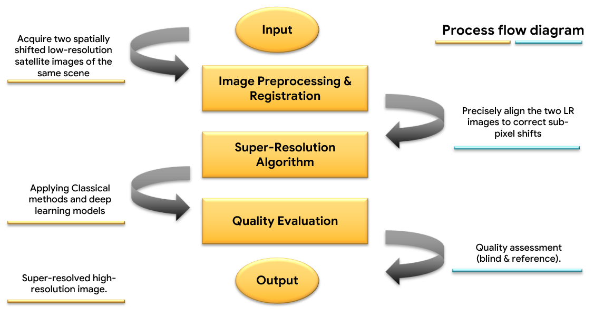
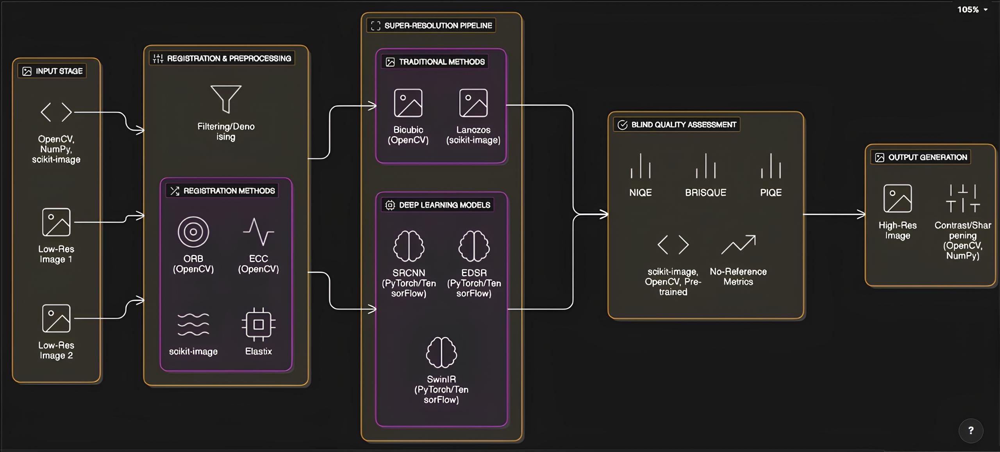
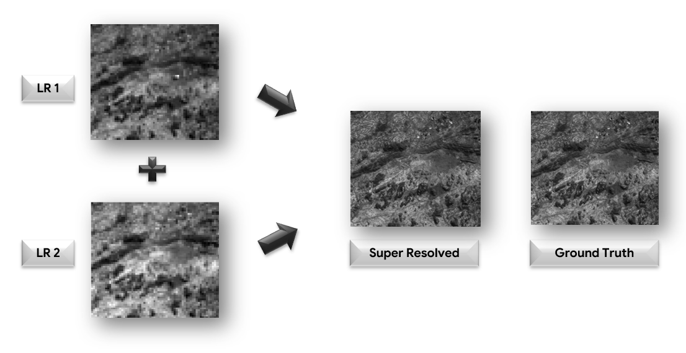

# 🌌 Dual Image Super Resolution for High-Resolution Optical Satellite Imagery and its Blind Evaluation

This project focuses on reconstructing **high-resolution optical satellite images** using two low-resolution images with slight spatial shifts. Unlike traditional single-image methods, this approach leverages **dual-image inputs** and integrates **blind image quality assessment (IQA)** to evaluate results even without ground truth high-resolution references.

---

## 🚀 Key Features
- **Dual-Image Input**: Utilizes spatially shifted LR images for capturing richer details.  
- **Hybrid Super Resolution**: Combines classical (interpolation + registration) and deep learning models (EDSR, SRCNN, Residual Blocks, PixelShuffle).  
- **Blind Evaluation**: Employs no-reference quality metrics (NIQE, BRISQUE, PIQE) for real-world applicability where HR references are unavailable.  
- **Robust & Scalable**: Designed for deployment in remote or data-scarce environments.  

---

## 📂 Project Workflow

### Process Flow Diagram  
  

1. **Input**: Two low-resolution satellite images of the same scene.  
2. **Preprocessing & Registration**: Image alignment to correct sub-pixel shifts.  
3. **Super-Resolution**: Apply classical and deep learning methods for HR reconstruction.  
4. **Quality Evaluation**: Blind & reference-based IQA.  
5. **Output**: High-resolution super-resolved image.  

---

## 🏗️ System Architecture
  

The pipeline integrates:  
- **Image Registration** (torchvision, PIL)  
- **Deep Learning Models** (PyTorch/TensorFlow)  
- **Blind IQA Models** (NIQE, BRISQUE, PIQE)  
- **Visualization** (Matplotlib, Seaborn)  

---

## 📊 Results
  

The system successfully enhances resolution and applies blind evaluation for quality scoring.  
- **Reference-based IQA**: PSNR, SSIM  
- **No-reference IQA**: NIQE, BRISQUE, PIQE  

---

## ⚙️ Tech Stack
- **Programming**: Python  
- **Libraries**: TorchVision, PIL, NumPy, Matplotlib, Seaborn  
- **Deep Learning**: PyTorch, TensorFlow  
- **Models**: EDSR, SRCNN, Residual Blocks, PixelShuffle  
- **IQA Metrics**: NIQE, BRISQUE, PIQE  

---

## 📑 How to Run

1. Clone this repository:
   ```bash
   git clone https://github.com/Yashpurbhe123/_Dual-Image-Super-Resolution_.git
   cd _Dual-Image-Super-Resolution_
   ```

2. Install dependencies:
   ```bash
   pip install -r requirements.txt
   ```

3. Run the Jupyter Notebook:
   ```bash
   Model_notebook.ipynb
   ```

---

## 👥 Team
- **Yash Purbhe**
- **Dipshree Vartak** 
- **Aditya Kokate**  
- **Manas Gurav**

---
